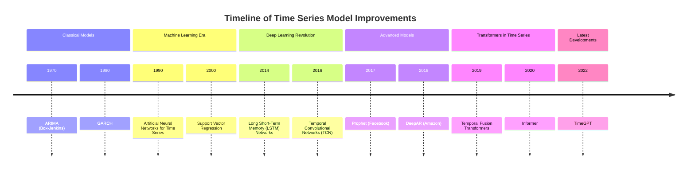

test
====

```mermaid
timeline
    title Timeline of Time Series Model Improvements
    section Classical Models
        1970 : ARIMA (Box-Jenkins)
        1980 : GARCH
    section Machine Learning Era
        1990 : Artificial Neural Networks for Time Series
        2000 : Support Vector Regression
    section Deep Learning Revolution
        2014 : Long Short-Term Memory (LSTM) Networks
        2016 : Temporal Convolutional Networks (TCN)
    section Advanced Models
        2017 : Prophet (Facebook)
        2018 : DeepAR (Amazon)
    section Transformers in Time Series
        2019 : Temporal Fusion Transformers
        2020 : Informer
    section Latest Developments
        2022 : TimeGPT
```
